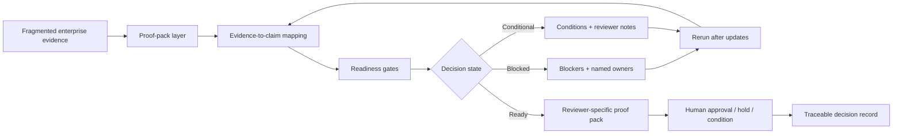

# TraceOS

**Public architecture surface for regulated evidence-to-decision systems.**

TraceOS is the architecture behind **ApprovalBrief AI**, a proof-pack system for regulated approval decisions.

ApprovalBrief AI helps teams turn fragmented evidence into review-ready proof packs before high-stakes approvals such as payment rollouts, vendor-risk reviews, internal AI tool approvals, and regulated enterprise change gates.

> AI prepares the proof.  
> Deterministic gates structure readiness.  
> Humans approve, condition, or hold.

## Public / private boundary

Public repositories contain only public-safe materials: concept notes, synthetic examples, diagrams, and validation framing.

Private repositories contain the product implementation, orchestration logic, evidence mappings, and vertical-specific workflow design.
