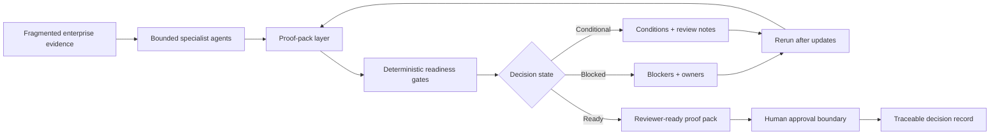

# TraceOS

_Public repository · Private product build active · Prototype / design-partner discovery_

**Architecture surface for regulated evidence-to-decision systems.**

TraceOS is the architecture behind **ApprovalBrief AI**, a proof-pack system for regulated approval decisions.

This repository exposes the public architecture surface only. Private orchestration logic, implementation details, evidence mappings, and design-partner workflows are intentionally not public.

ApprovalBrief AI is built on a simple control principle:

> **Bounded specialist AI agents prepare proof artifacts.**  
> **Deterministic readiness gates structure the decision state.**  
> **Humans approve, condition, hold, or escalate.**

The first product wedge focuses on workflows where fragmented evidence must become reviewable before a high-stakes decision can move forward:

- payment pilots and controlled rollouts
- vendor / ICT third-party risk approvals
- internal AI tool approvals
- regulated enterprise change gates

### Public / private boundary

Public repositories contain only public-safe materials: concept notes, synthetic examples, high-level diagrams, and validation framing.

Private repositories contain the product implementation, orchestration logic, evidence mappings, and vertical-specific workflow design.
